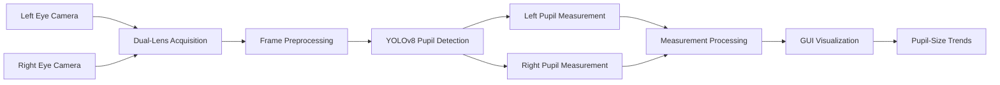
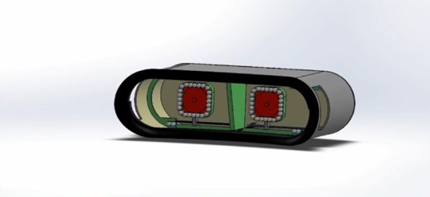
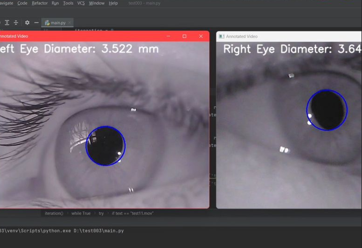
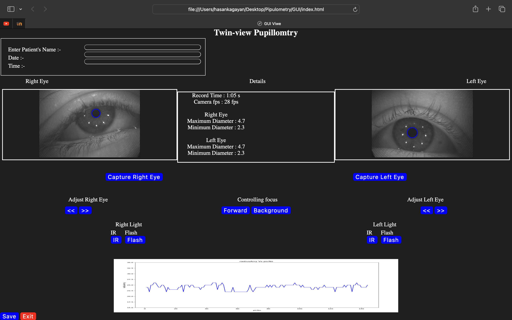

# 👁️ Twin-View Pupillometry — A Dual-Lens Solution

[](https://www.python.org/)
[](https://github.com/ultralytics/ultralytics)
[](https://opencv.org/)
[](#-dual-lens-hardware)
[](#-recognition)

> **A dual-lens hardware-software prototype for simultaneous pupil monitoring using computer vision and real-time image analysis.**
>
> The system combines dual-eye image acquisition, pupil detection, measurement, and graphical visualization to support objective monitoring of pupil-size changes over time.

---

## 🏆 Recognition

### First Runner-Up

**Medical Electronics and Coding Hackathon**  
University of Colombo, Sri Lanka

The project was recognized for combining a custom hardware prototype with computer vision and automated pupil analysis.

---

## 📖 Project Overview

Pupil size and pupillary response can provide useful information during neurological assessment.

Traditional manual assessment can depend on subjective visual observation and can make continuous bilateral monitoring difficult.

**Twin-View Pupillometry** was developed as a hardware-software prototype that explores automated observation of both pupils using:

- a **dual-lens imaging system**
- computer-vision preprocessing
- **YOLOv8-based pupil detection**
- automated pupil measurement
- real-time visualization through a graphical interface

The project focuses on integrating hardware design with computer vision to provide a more objective and repeatable pupil-monitoring workflow.

---

## 🏗️ System Architecture



---

## 🛠️ Dual-Lens Hardware

A key feature of the project is the **dual-lens imaging configuration**, designed to observe the left and right eyes within the same monitoring system.

The prototype integrates:

- two imaging paths
- camera modules
- optical components
- mechanical housing
- computer-vision processing
- graphical monitoring software

This design enables bilateral pupil observation within a single system.

<p align="center">
  
</p>

<p align="center">
  
</p>

---

## 🎞️ Hardware Design Animation

The exploded-view animation illustrates the arrangement of the mechanical, optical, and imaging components used in the prototype.

<p align="center">
  
</p>

🎥 [View Full Exploded-View Animation](assets/videos/exploded_view.mp4)

---

## 🔍 Pupil Detection Pipeline

The computer-vision pipeline processes captured eye images and detects the pupil region before measurement.

```text
Eye Image / Video Frame
        ↓
Image Preprocessing
        ↓
YOLOv8 Pupil Detection
        ↓
Pupil Localization
        ↓
Pupil Measurement
        ↓
Left / Right Eye Tracking
        ↓
GUI Visualization
```

### Image Processing

The processing stage was developed using **OpenCV** and prepares captured eye images for model inference.

Processing operations include:

- image resizing
- contrast adjustment
- noise reduction
- region-of-interest handling
- frame preparation for pupil detection

---

## 🧠 YOLOv8 Pupil Detection

The system uses **YOLOv8** for automated pupil localization.

The detection stage identifies the pupil region from captured eye images, enabling subsequent measurements to be generated programmatically instead of relying only on manual visual estimation.

The pupil-detection component was also evaluated during development using the **openEDS eye-image dataset**.

```text
Input Eye Image
      ↓
YOLOv8
      ↓
Pupil Detection
      ↓
Pupil Region
      ↓
Measurement
```

<p align="center">
  
  
</p>

---

## 📈 Model Training

The following figure shows the training history recorded during development of the pupil-detection model.

<p align="center">
  
</p>

> The figure is included as development-training history and is not presented as a standalone final performance benchmark.

---

## 📊 Pupil Measurement & Monitoring

After detecting the pupil region, the software extracts pupil measurements from successive frames.

The system is designed to monitor:

- left-eye pupil size
- right-eye pupil size
- bilateral pupil-size variation
- pupil measurements over time

These measurements can then be displayed through the graphical interface for visual analysis of trends.

---

## 🖥️ Monitoring Interface

A graphical interface was developed to display pupil measurements and their variation over time.

The interface provides:

- visual feedback from the imaging system
- left- and right-eye pupil measurements
- graphical visualization of pupil-size changes
- continuous display of captured measurements

<p align="center">
  
</p>

---

## 🎬 Concept Demonstration

The following animation illustrates the intended monitoring workflow of the Twin-View Pupillometry system.

🎥 [Watch Concept Demonstration](assets/videos/concept_demo.mp4)

> This animation is a conceptual representation of the proposed workflow and does not represent a validated clinical deployment.

---

## 🔬 openEDS Validation

The pupil-detection component was evaluated using images from the **openEDS dataset** during development.

The dataset provided eye-region imagery for testing the image-processing and YOLOv8-based pupil-detection workflow across varying eye appearances.

> This dataset-based evaluation represents engineering validation of the computer-vision component and does not constitute clinical validation of the complete device.

---

## ✨ Key Contributions

- **Dual-lens hardware design** for bilateral eye observation
- **Computer-vision preprocessing** for pupil imagery
- **YOLOv8-based pupil localization**
- Automated pupil measurement
- Left/right pupil monitoring
- Graphical visualization of pupil-size trends
- Hardware-software integration within a functional prototype

---

## 🧰 Technology Stack

### Computer Vision

- Python
- YOLOv8
- OpenCV
- Image preprocessing

### Visualization

- Matplotlib
- Graphical user interface
- Pupil measurement visualization

### Hardware & System Design

- Dual-lens imaging configuration
- Camera integration
- Optical/mechanical prototype design
- Real-time image acquisition

### Validation

- openEDS eye-image dataset

---

## ⚠️ Limitations

Twin-View Pupillometry was developed as an **engineering and research prototype**.

Current limitations include:

- pupil detection can be affected by illumination and image quality
- camera alignment can influence measurement consistency
- model performance may vary across different eye appearances and acquisition conditions
- the prototype has not undergone clinical-device validation
- pupil measurements should not be interpreted independently as medical diagnoses

---

## 🚀 Future Development

Potential extensions include:

- improved physical pupil-diameter calibration
- more robust detection under varying illumination
- automated pupillary light-reflex analysis
- temporal analysis of pupil response
- wireless data communication
- more compact hardware design
- broader validation across independent datasets

---

## ⚕️ Research Use Disclaimer

This project was developed for **engineering research, prototyping, and academic evaluation**.

It is **not a certified medical device** and should not be used independently for clinical diagnosis, treatment decisions, or patient monitoring.

---

## 🤝 Acknowledgements

- **openEDS** — eye-image dataset used during pupil-detection development and evaluation
- **Ultralytics** — YOLOv8 computer-vision framework
- **OpenCV** — image-processing framework
- **University of Colombo** — Medical Electronics and Coding Hackathon

---

## 👤 Author

**Tirush Dumil Wickramasingha**

[GitHub](https://github.com/Tirush-Leo) •
[LinkedIn](https://www.linkedin.com/in/tirush-dumil/) •
[Google Scholar](https://scholar.google.com/citations?user=WRrjwsoAAAAJ&hl=en)
